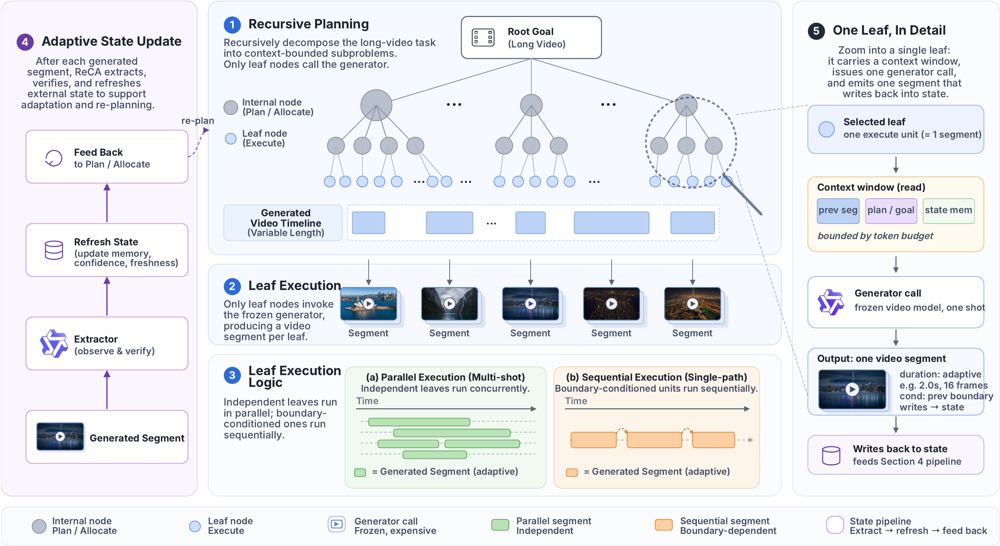

# ReCA: Recursive Context Allocation for Multi-Shot Video Extrapolation

<p align="center">
  
</p>

> **ReCA** extends multiple visual anchors into a long, multi-shot continuation while
> preserving identity, scene state, object relations, and event causality across the
> generated sequence — by *decomposing* the long-video task into a tree of context-bounded
> shot jobs and *allocating* a compact per-shot context window to each call of a frozen
> short-video generator.

## Abstract

Long-video generation with a frozen short-video model breaks down once the story spans
more than a single shot: prompt length explodes, identities drift, and the next shot
forgets what just happened. ReCA reframes the task as **Multi-Shot Video Extrapolation**
— given one or more visual anchors and a narrative intent, synthesise a long,
multi-shot continuation that stays consistent across cuts. The framework holds task state
*outside* the generator, plans the continuation as a recursive tree of shots, allocates
a per-shot context window to each leaf, and writes the tail frame back into the state
memory so the next leaf can pick up where the last one left off.

## Core Components

| # | Component | What it does |
|---|---|---|
| ① | **Recursive Planning** | Builds a root-to-shot schedule with semantic goals, durations, boundary conditions, and dependency links — never sending the full story to a single call. |
| ② | **Leaf Execution** | Each leaf is one bounded call to the frozen short-video generator (e.g. Wan 2.7, Happyhorse, Seedance i2v). |
| ③ | **Parallel / Serial Logic** | Parallelism at the **shot** level (independent anchors render together); segments inside a single shot stay **serial** (each segment's first frame = the previous segment's tail). |
| ④ | **Adaptive State Update** | A validator chain (extractor → refresh → feedback) flags drift, then triggers a targeted re-render before the next leaf consumes the bad state. |
| ⑤ | **State Memory** | Portraits, locations, and props that persist across shots, fed back as identity references inside each per-shot context window. |

## Multi-Shot Video Extrapolation (MSVE)

The task targeted by ReCA. Inputs:

- One or more **visual anchors** — first-frame images that pin scene/character identity.
- A **narrative intent** — natural-language description of the continuation.

Output: a multi-shot video that respects the anchors *and* the narrative, with
identity / state / event causality preserved across shot boundaries.

## Synthesised Videos

The interactive demo replays five real ReCA runs end-to-end — shot planning →
state memory build → per-segment render → ④ validator → re-render → final concat.

| Demo | Variant |
|---|---|
| Boxing | Single-pass |
| Dumplings | Single-pass |
| Couple | ④ validator → re-render |
| World Landmarks | ④ validator → re-render |
| Heavenly Titans | ④ validator → re-render |

Open [`/demo/`](demo/) to watch the replays. The landing page (this site's `/`)
is itself the paper-level method walkthrough with framework comparisons.

## Repository Layout

```
ReCA/
├── README.md              # this file
├── LICENSE                # MIT
├── index.html             # paper-level method walkthrough — landing page
├── app.js / styles.css    # walkthrough scripts/styles
├── assets/                # method figures
├── data/                  # walkthrough metadata
└── demo/                  # interactive ReCA replay (SPA)
    ├── index.html
    ├── app.js / app.css
    └── data/              # 5 pre-recorded demo manifests + index.json
```

## License

[MIT](LICENSE).
